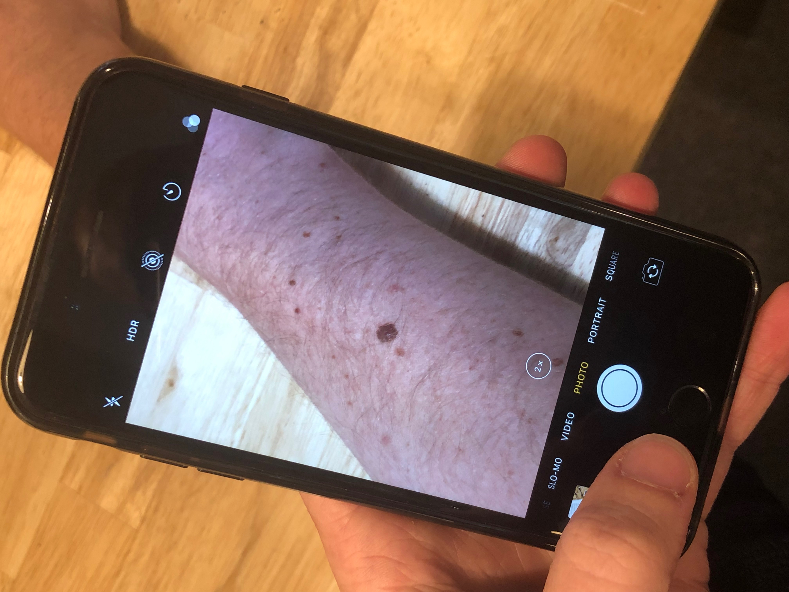
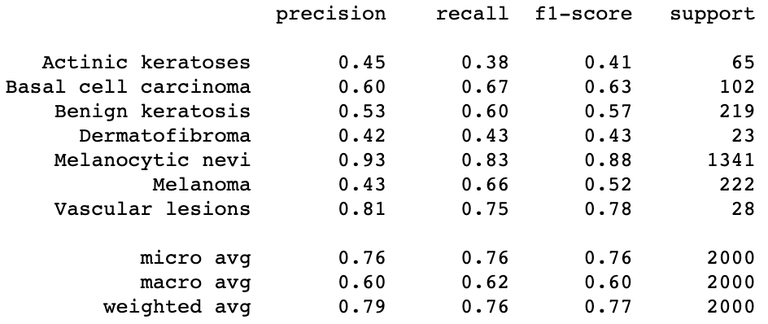
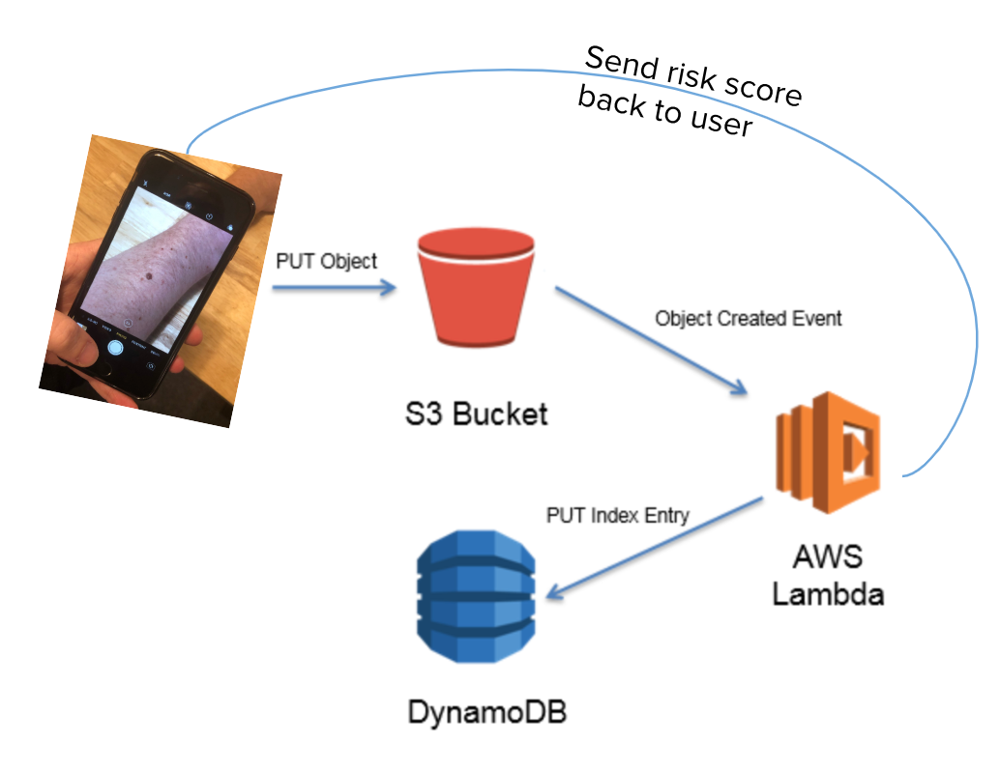

# Objective
Develop a Skin Cancer Screener that can classify 7 diagnostic categories of skin lesions.

# Evaluation Criteria
If we pick at random (1 out of 7 diagnostic categories), then we will be correct 14.28% of the time. A model that can predict the diagnostic categories at a rate of 50% or better will perform at least four times better than random chance, and that would be a relatively successful model.

# Background
Skin cancer is the most common form of cancer in the United States with an annual cost of care exceeding $8 billion. With early detection, the 5 year survival rate of the most deadly form, melanoma, can be up to 99%; however, delayed diagnosis causes the survival rate to plummet to 23%.

[The HAM10000 dataset](https://dataverse.harvard.edu/dataset.xhtml?persistentId=doi:10.7910/DVN/DBW86T) iis an extensive collection of multi-source dermatoscopic images of common pigmented skin lesions. The dataset consists of 10015 dermatoscopic images. This collection of images represent about 95% of the seven diagnostic categories in the realm of pigmented lesions, as seen in clinical settings: 

1. Actinic Keratoses and intraepithelial carcinoma / Bowen's disease (akiec)
2. Basal Cell Carcinoma (bcc)
3. Benign Keratosis-like lesions (solar lentigines / seborrheic keratoses and lichen-planus like keratoses, bkl)
4. Dermatofibroma (df)
5. Melanoma (mel)
6. Melanocytic Nevi (nv)
7. Vascular Lesions (angiomas, angiokeratomas, pyogenic granulomas and hemorrhage, vasc).

More than 50% of lesions are confirmed through histopathology (histo), the ground truth for the rest of the cases is either follow-up examination (follow_up), expert consensus (consensus), or confirmation by in-vivo confocal microscopy (confocal). The dataset includes lesions with multiple images, which can be tracked by the lesion_id column within the HAM10000_metadatafile

# Process
The image categories were utterly unbalanced. Almost 50% of images pertain to one group, another 20% belong to two other types, and the final 30%  are spread in the remaining four categories. We tried to run our model using various class weights to remedy this imbalance in data, but this strategy yielded poor results.

Our dataset was broken down as follows: 64% training, 16% validation, 20% testing. We decided that we need to augment our training data set. We created a function that would create various images from each of the underrepresented categories and implemented image manipulations like rotate, blur, shear, etc. to balance the data set. The training data set increased from 6400 to over 30000 images.

We built 3 Convolutional Neural Networks (CNN) and used transfer learning from 2 other pre-built models. Many iterations of each model and hyperparameter tuning were performed like:

- Adding/removing layers
- Batch Normalization
- Droupout
_ L2 Regularization
- Learning Rate
- Dilation Rate
- Learning Rate on Plateau
- Optimizers: Stochastic Gradient Descent and ADAM

The best performing model was one of the CNNs we built with 11 convolution layers (You can see the rest of the models and their results in the Jupyter Notebook). We were able to achieve a 76% precision and recall. One of the challenges was the time it took to train the network, so we were forced to use half the training data (15000 images) to speed up the process.  

# Model Improvement
To improve model performance,  we need to implement the following:

-  A lot more images for training
-  Modifying the model to include more convolution layers 
-  Experimenting with hyperparameters such as: adaptable learning rates, Dropout, and L2 regularization
-  Develop an app for both IOS and Android: This will allow us to get users to submit the pictures of their skin lesions and will give our platform a continual stream of images to further train our model and refine it. Additionally, it will provide users with their risk score.

# Project Roadmap
Obviously, beyond the training and model tweaking, we need to have an infrastructure that can support images at scale, and that is responsive. To that end, we will be using Amazon Web Services (AWS) to develop this architecture. When a user takes a picture with their app of their skin lesion, the image is saved to an S3 bucket which triggers an AWS Lambda action. Lambda will invoke the convolutional neural network (CNN) which will be available as an endpoint on AWS Sagemaker. Once the model runs and processes the images, the result will be stored in another S3 bucket that will trigger another lambda event, this time a message back to the user in their app, detailing whether they should seek medical attention with a degree of confidence. Model predictions, along with images file paths will and other relevant transactions are saved in a Dynamo DB.

As we get more images and more training to our model, our degree of confidence will rise. Coupling the continuous training with an evolving CNN and hyperparameter tuning, we believe that reaching a level of accuracy over 90% is certainly within reach. 

There is no reason why two people in the US should die from skin cancer every hour. We have a simple yet powerful vision: 
**Snap a picture and potentially, save your life**.

