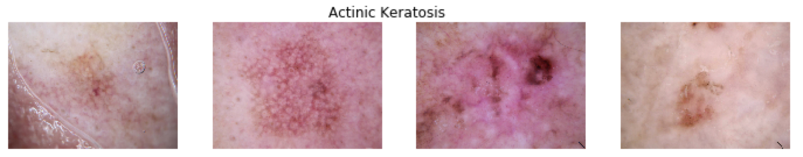
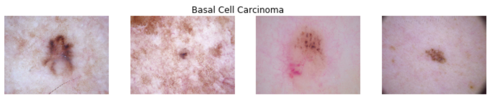
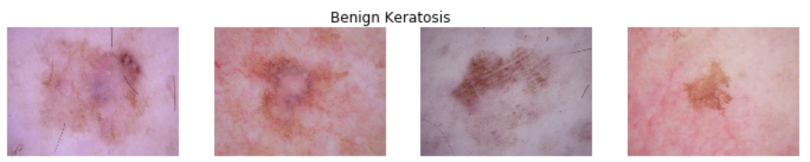
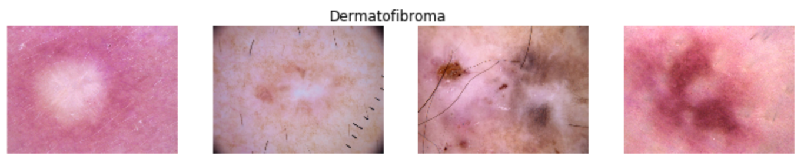
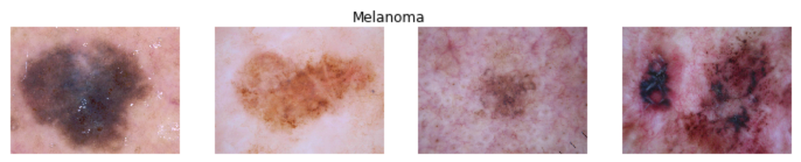
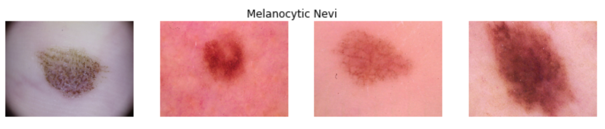
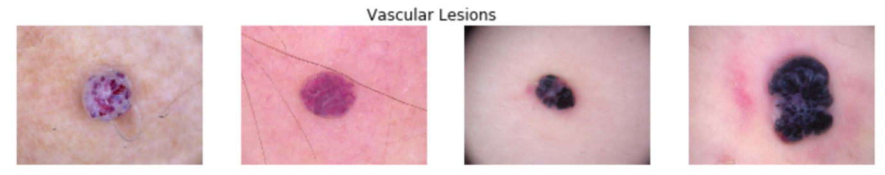
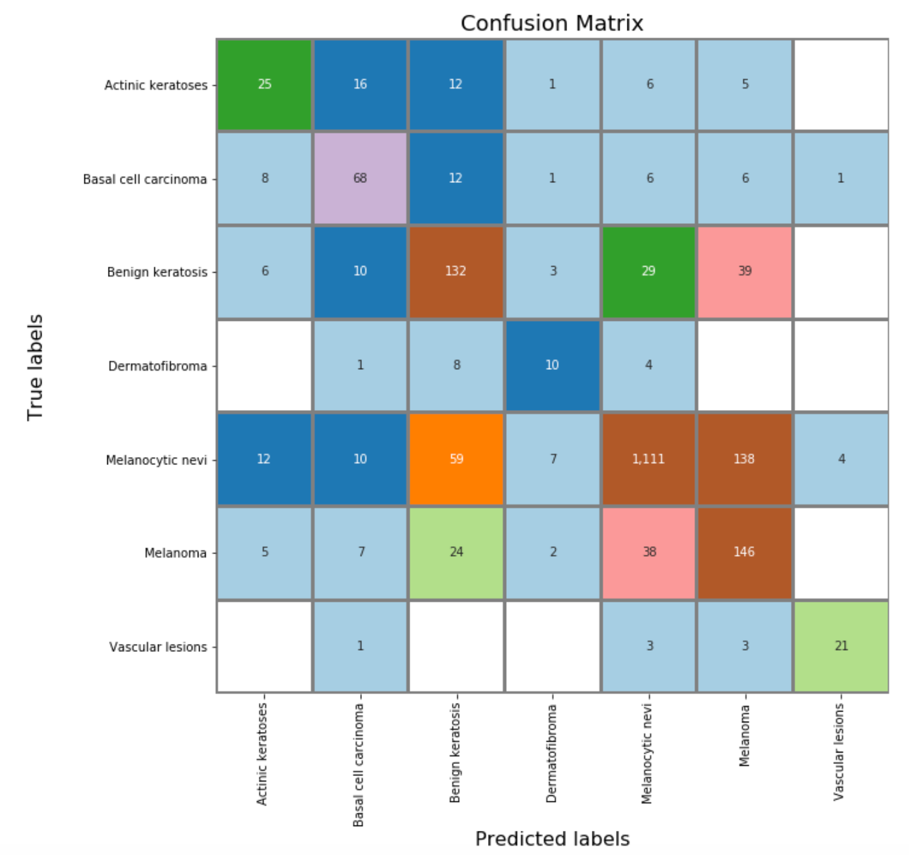

# Cancer Screener
# 1. **Business Understanding**

## 1a) **Problem Definition**

Skin cancer is the most common form of cancer in the United States, with an annual cost of care exceeding $8 billion. With early detection, the 5 year survival rate of the most deadly form, melanoma, can be up to 99%; however, delayed diagnosis causes the survival rate to plummet to 23%.

The  dataset consists of 10015 dermatoscopic images. These collection of images represent almost 95% of 7 diagnostic categories in the realm of pigmented lesions as seen in clinical settings: 
- Actinic Keratoses and intraepithelial carcinoma / Bowen's disease (akiec)
- Basal Cell Carcinoma (bcc)
- Benign Keratosis-like lesions (solar lentigines / seborrheic keratoses and lichen-planus like keratoses, bkl)
- Dermatofibroma (df)
- Melanoma (mel)
- Melanocytic Nevi (nv)
- Vascular Lesions (angiomas, angiokeratomas, pyogenic granulomas and hemorrhage, vasc).

More than 50% of lesions are confirmed through histopathology (histo), the ground truth for the rest of the cases is either follow-up examination (follow_up), expert consensus (consensus), or confirmation by in-vivo confocal microscopy (confocal). The dataset includes lesions with multiple images, which can be tracked by the lesion_id column within the HAM10000_metadatafile.

## 1b) **Success/Evaluation Criteria**

if we pick at random (1 out of 7 diagnostic categories) then we will be correct 14.28% of the time. If we have a model that can predict the diagnostic category at a rate of 50% or better, than that model will perform at least 4 times better than random chance and that would constitute a successful evaluation criteria.

# 2. **Data Understanding**

## 2a) **Public Data**
[The HAM10000 dataset](https://dataverse.harvard.edu/dataset.xhtml?persistentId=doi:10.7910/DVN/DBW86T) is a large collection of multi-source dermatoscopic images of common pigmented skin lesions

# Need Title

# 3. **Next Steps**
## 3a) **Model Improvement**
Our best model performed at a precision and recall of 76%. That model has 11 convolutional layers. We believe that in order to make it perform better it needs four things:

-  1. A lot more images for training
-  2. Modifying the model to include more convolution layers 
-  3. Experimenenting with hyperparameters such as: adaptable learning rates, Dropout, and L2 regularization
-  4. Develop an app for both IOS and Android: This will allow us to get users to submit the pictures of their skin lesions and will give our platform a continual stream of images to further train our model and refine it. Additionally, it will give the users a feedback whether they need to consult with a doctor or not.

## 3b) **Project Roadmap**
Obviously, beyond the training and model tweaking we need to have an infrastructure that can support images at scale and that is responsive. To that end, we will be using Amazon Web Services (AWS) to develop this architecture. When a user takes a picture in their app of their skin lesion, this image will be saved on an S3 bucket which will trigger a an AWS Lambda action. Lambda will invoke our convolutional neural network (CNN) which will be available as an end point on AWS Sagemaker. Once the model runs and processes the images, the result will be stored in another S3 bucket that will trigger another lambda event, this time a message back to the user in their app, detailing whether they should seek medical attention with a degree of confidence.

As we get more images and more training to our model, our degree of confidence will rise. Coupling the continuous training  with an evolving CNN and hyperparameter tuning, we believe that reaching a level of accuracy over 90% is certainly within reach. 

There is no reason why 2 people in the US should die from skin cancer every hour. We have a simple yet a powerful vision: 
**Snap a picture and potentially, save your life**.
